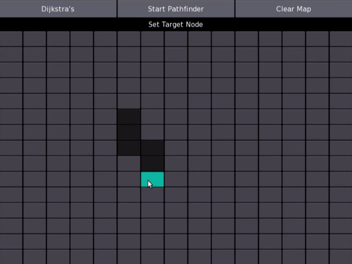

[]()



# Python-Kivy-Pathfinder-Visualization
> The tool presented here searches the path between a starting node and a goal node. The search is illustrated step by step. The search algorithm can be chosen freely.

The user only has to insert obstacles/walls, choose the starting and destination node and select the desired search algorithm.


## Installation

#### Ubuntu / Kubuntu / Xubuntu / Lubuntu (Saucy and above)¶

##### Add one of the PPAs as you prefer

```
        stable builds:	$ sudo add-apt-repository ppa:kivy-team/kivy
        nightly builds:	$ sudo add-apt-repository ppa:kivy-team/kivy-daily
```
##### Update your package list using your package manager
```
        $ sudo apt-get update
```
##### Install Kivy
```
        Python2 - python-kivy:
         	$ sudo apt-get install python-kivy
        Python3 - python3-kivy:
         	$ sudo apt-get install python3-kivy
        optionally the gallery of Examples - kivy-examples:
         	$ sudo apt-get install kivy-examples
```
  
## Usage example


The navigation bar shows which input is expected from the user. First of, obstacle elements must be placed by mouse click. The number of remaining obstacles to place is shown in the navigation bar at the top. You can change the number of obstacles in the config.py file. 
```
        MAX_WALLELEMENTS = 5 # number of obstacles
```


First of, obstacle elements must be placed by mouse click.


Next, the starting node and target node must be set.


Finally, you can pick the desired search algorithm and start the search.

 


## Meta

Anel Music– [@LinkedIn](https://www.linkedin.com/in/anelmusic/) – anel.music@web.de

Distributed under the MIT license. See ``LICENSE`` for more information.

[https://github.com/AnelMusic/](https://github.com/AnelMusic/)

## Known Issues
1. Best-First-Search must be implemented
2. Bidirectional Dijkstra must be implemented
3. CLI needed

## Contributing

1. Fork it (<https://github.com/AnelMusic/Python-Kivy-Pathfinder-Visualization/fork>)
2. Create your feature branch (`git checkout -b feature/fooBar`)
3. Commit your changes (`git commit -am 'Add some fooBar'`)
4. Push to the branch (`git push origin feature/fooBar`)
5. Create a new Pull Request
